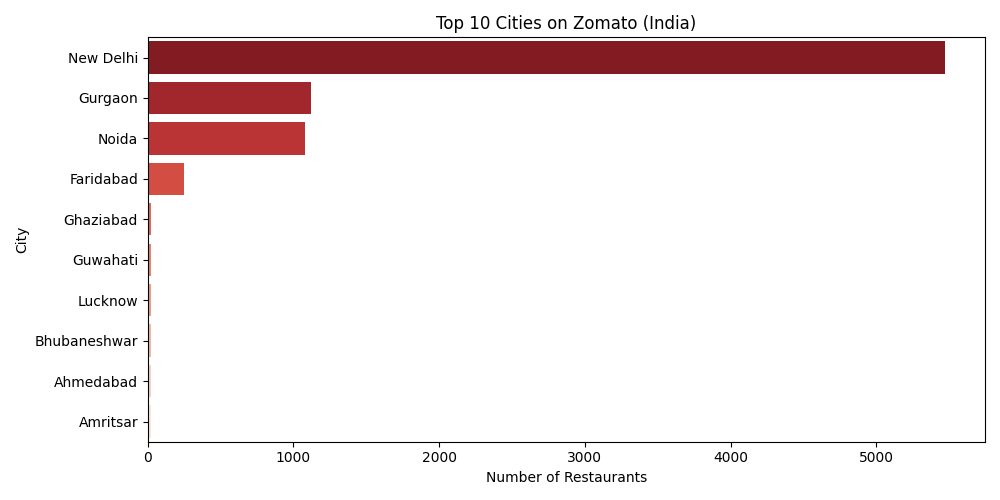
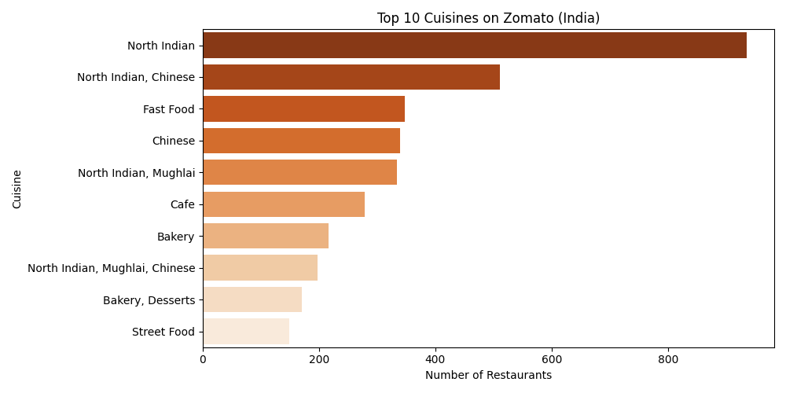
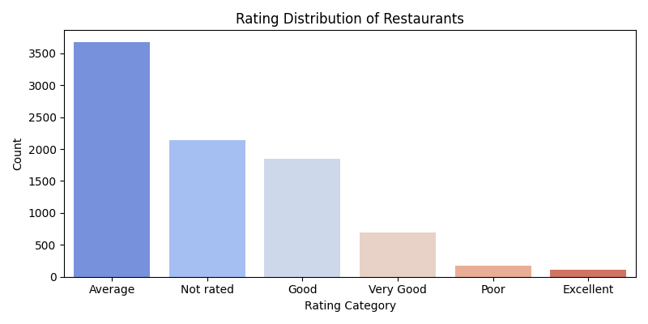
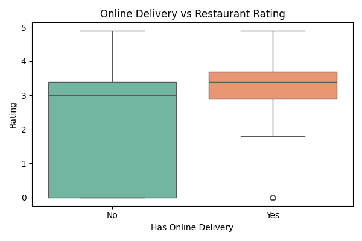

# 🍽️ Zomato Restaurant Data Analysis

## 📌 Problem Statement
In a competitive food delivery market, understanding customer preferences and restaurant performance is crucial. This project analyzes Zomato data to uncover insights on ratings, pricing, delivery trends, and cuisine popularity to support data-driven business decisions.

## 📌 Project Overview
End-to-end data analytics project on 9,500+ Zomato restaurant records 
to uncover insights on pricing, delivery trends, cuisine popularity, 
and city-wise restaurant performance.

## 🛠️ Tools & Technologies
- **Python** (Pandas, Matplotlib, Seaborn) — EDA & Visualizations
- **SQL** — Business queries & aggregations
- **Power BI** — Interactive dashboard
- **Excel** — Data cleaning & preprocessing

## 🔄 Workflow
Data Cleaning (Excel) → SQL Analysis → Python EDA → Power BI Dashboard

- ## 📈 Visualizations
 
### 🏙️ Top 10 Cities on Zomato (India)

### 🍛 Top 10 Cuisines on Zomato (India)

### ⭐ Rating Distribution of Restaurants

### 🛵 Online Delivery vs Restaurant Rating

## 📁 File Structure
| File | Description |
|------|-------------|
| `Python EDA notebook` | Python EDA notebook with charts |
| `zomato_cleaned_csv.xlsx` | Cleaned dataset (9,551 rows) |
| `query_1.xlsx` | Top cities by restaurant count & rating |
| `query2.xlsx` | Top cuisines by votes & rating |
| `query3.xlsx` | Online delivery impact on ratings |
| `query4.xlsx` | Price range vs rating analysis |
| `query5.xlsx` | Rating distribution breakdown |
| `ZOMATO_DASHBOARD.pbix` | Power BI interactive dashboard |

## 📊 Key Insights
- New Delhi dominates with 5,473 restaurants on the platform
- Restaurants with online delivery score **45% higher** in ratings on average
- Premium price-range restaurants average **3.57 rating** vs 1.93 for budget
- Only ~22% of restaurants offer online delivery — a major growth opportunity
- North Indian cuisine has the highest count but faces tough rating competition

- ## 💼 Business Impact
- Helps Zomato identify high-performing cities and cuisines  
- Supports decision-making for expanding online delivery services  
- Enables better pricing strategies based on customer rating trends  

## 🚀 How to Run
1. Open `Python EDA notebook` in Jupyter Notebook or Google Colab
2. Upload `zomato_cleaned_csv.xlsx` as the data source
3. Run all cells to generate visualizations
4. Open `.pbix` file in Power BI Desktop for the dashboard
